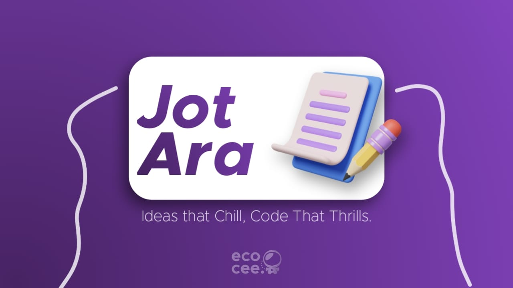

# Jot Ara

## About the Project

**Jot Ara** is a modern note-taking application designed for simplicity and productivity. Built using [Electron.js](https://www.electronjs.org/) for cross-platform desktop support, it leverages [React](https://react.dev/) and [TypeScript](https://www.typescriptlang.org/) for robust, maintainable code. The UI is crafted with [Material UI](https://mui.com/) for a clean, responsive experience, and the UX is thoughtfully designed to maximize ease of use.

    
    
    

Whether you're jotting down quick ideas or organizing detailed notes, Jot Ara provides an intuitive interface and powerful features to help you stay organized.

## Features

- Fast and responsive UI
- Secure and private notes
- Easy organization and search
- Cross-platform desktop support

## Author

**Sreeraj V Rajesh**  
2025

## License

This project is licensed under the [MIT License](LICENSE).

## Looking for Collaborators

We welcome contributions from developers, designers, and testers! If you're interested in collaborating, please open an issue or submit a pull request.

---

> _Jot your ideas. Organize your thoughts. Achieve more with Jot Ara._